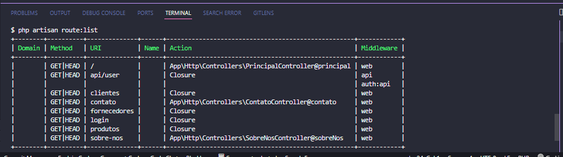
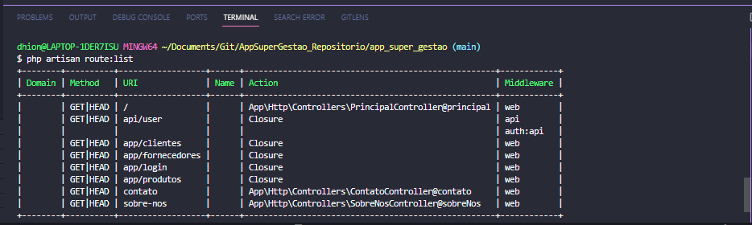

## Arquivo para salvar os comandos executados nas aulas:

* Criando controllers principal, sobrenos e contato:
```
php artisan make:controller PrincipalController
```
```
php artisan make:controller SobreNosController
```
```
php artisan make:controller ContatoController
```
```
php artisan route:list
```


* Agrupando as rotas:


* Criando controller com artisan:
```
php artisan make:controller TesteController
```
* Criando controller para o fornecedor:
```
php artisan make:controller FornecedorController
```