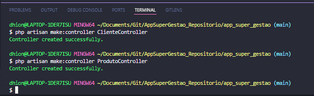

## Autenticação de usuários de forma manual
* Criando LoginController:
```php artisan make:controller LoginController```

* Criando HomeController:
```php artisan make:controller HomeController```

* Criando ClienteController e ProdutoController
``` php artisan make:controller ClienteController```
``` php artisan make:controller ProdutoController```
