## Arquivo para salvar os comandos executados nas aulas:

* Criando controllers principal, sobrenos e contato:
```
php artisan make:controller PrincipalController
```
```
php artisan make:controller SobreNosController
```
```
php artisan make:controller ContatoController
```
```
php artisan route:list
```


* Agrupando as rotas:


* Criando controller com artisan:
```
php artisan make:controller TesteController
```
* Criando controller para o fornecedor:
```
php artisan make:controller FornecedorController
```
* Criando um model com migration :
* OBS: O "-m" especificado no final do comando é para informar que junto com a criação desse modelo é para executar uma migration
pois esse modelo vai ter executar operações de banco de dados

```
 php artisan make:model SiteContato -m
```
* Criando as migrações:
* ```php artisan migrate```
* OBS erro :  could not find driver (SQL: PRAGMA foreign_keys = ON;) - Ao executar o migrate no sqlite
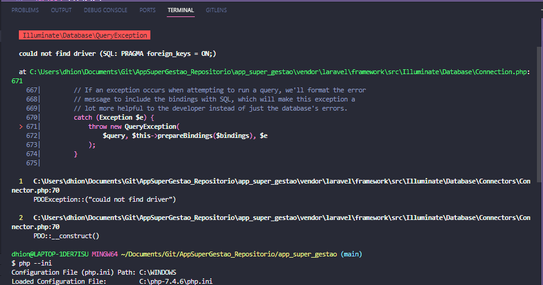
* Sera necessário ir até o arquivo php.ini e remover o ; da instrução  sqlite_pdo
* 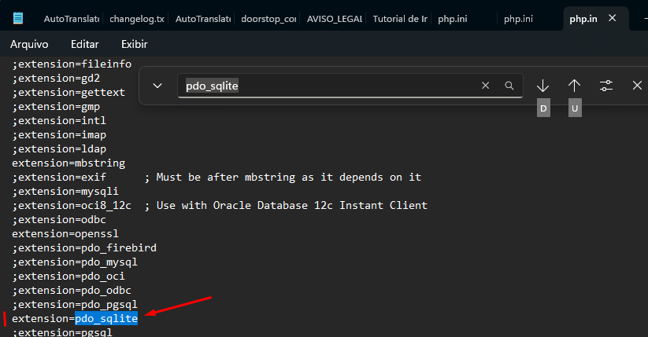
* Sera necessário ir até o arquivo php.ini e remover o ; da instrução  pdo_mysql
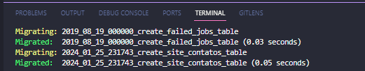
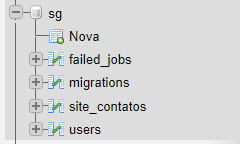
* migration para alterar tabela existente:
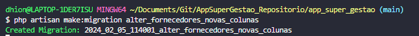
* Executando migrate:
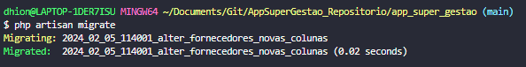
resultado:

* Executando rollback, voltando para estrutura anterior a último migrate:
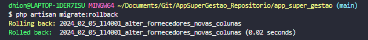
resultado:
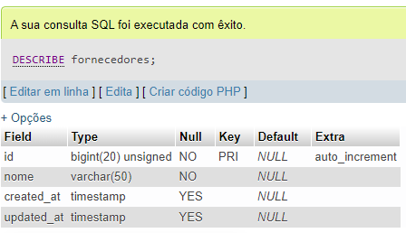

* Rollback de passo duplo:
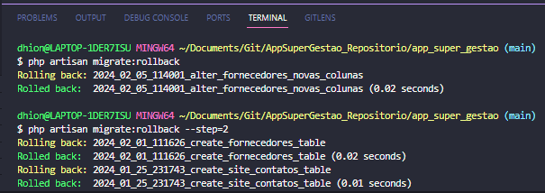
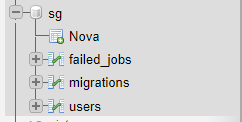

* Criando migration para tabela de produtos
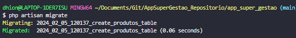

* Criando valores default e permitindo que outros possam ser nulos;
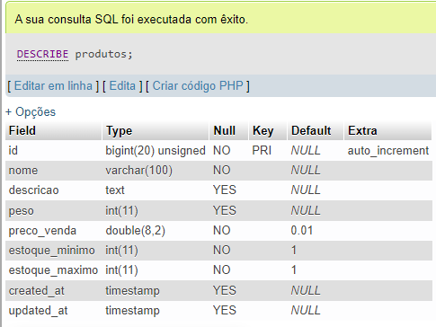

* Criando tabela produto detalhes e definindo uma chave estrangeira 1 para 1 nela
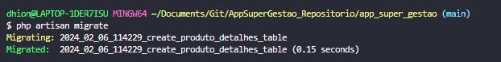

* Visualizando as migrations existentes:
```php artisan migrate:status```
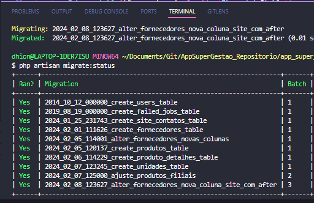

* Resetando o banco para o estado inicial com comando reset da migration:
- OBS: Esse comando executa todos o métodos down da migration de forma decremental até seu estaduo inicial, como se executasse um rollback para cada migration já criada.
``` php artisan migrate:reset```
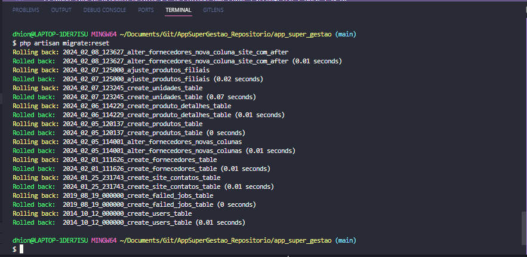

* Refresh, esse comando executa um reset e logo em seguida um migrate , ele serve para zerar o banco e recriar:
```php artisan migrate:refresh```
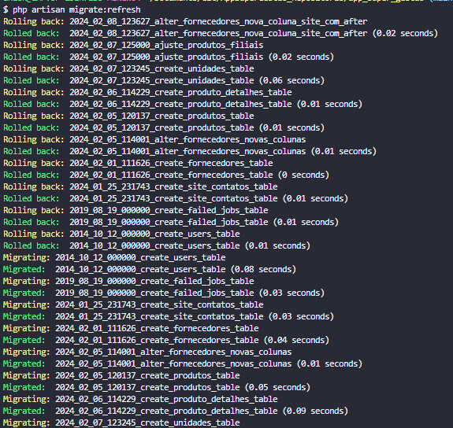
* Fresh, drop todos os elementos do banco e dps executa o migrate para recriar os objetos
```php artisan:fresh```
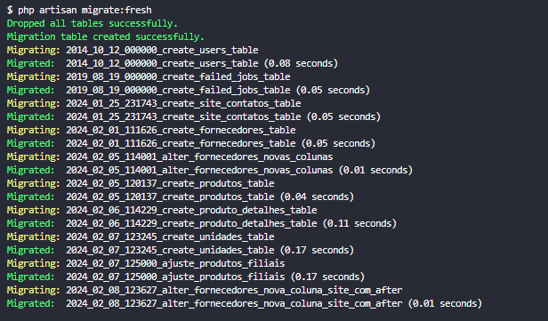