### Comandos usados no tinker
* Instanciando uma classe no tinker:
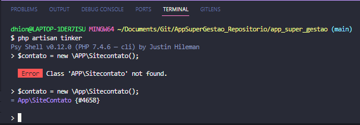
* As clases instanciadas pelo eloquent orm, vem do banco de dados herdando como atributo todas as suas colunas:
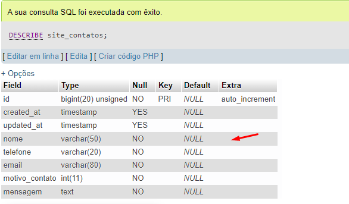
* Logo podemos definir valores para seus respectivos atributos.
- Definindo um valor para o atributo nome em tempo de execuçãoo com tinker:
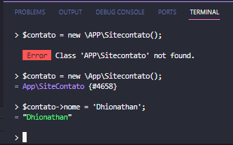
* Definindo alguns atributos e utilizando o metodo gettAtributes herdado de model no eloquent:
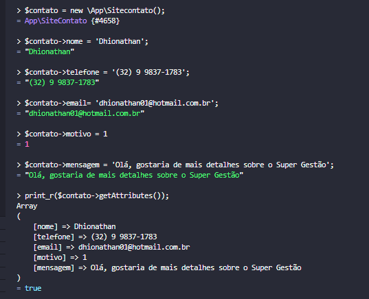
* Salvando os valores no banco de dados pelo tinker COMANDO:
``` $contato->save();```


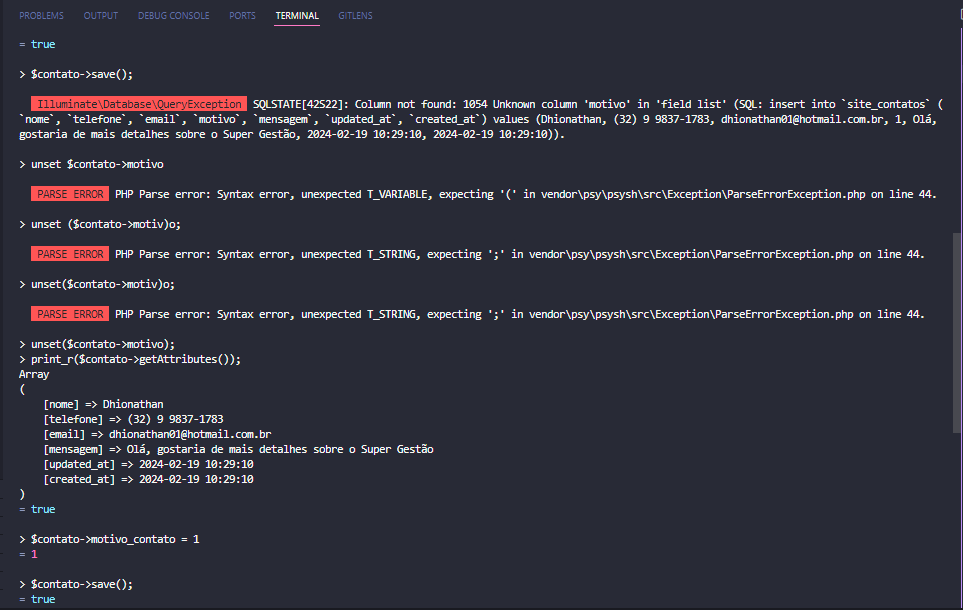

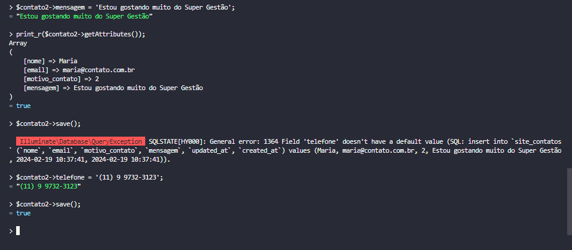
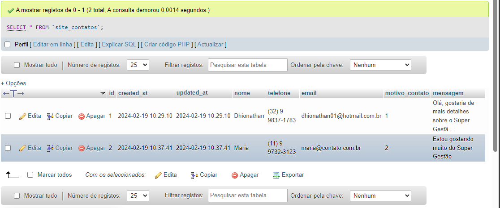

* Criando registros com metodo estático create, utilizando o atributo fillable:
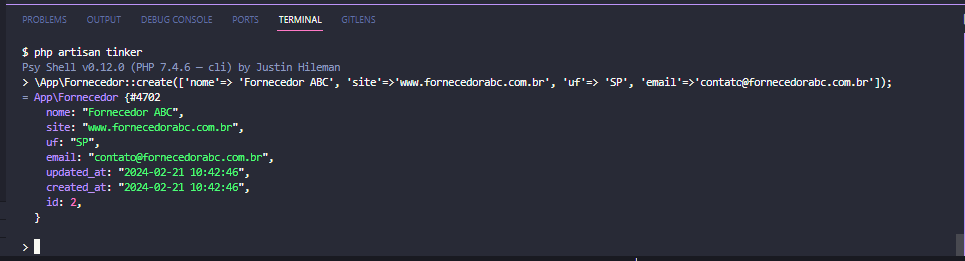
* Recuperando registros com all();
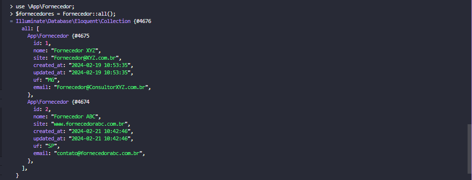
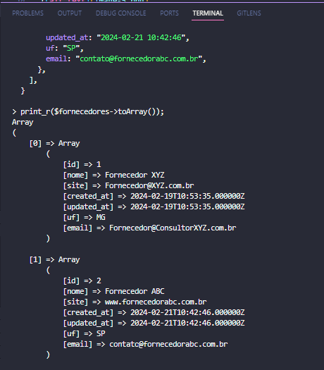

* Recuperando registros com find();

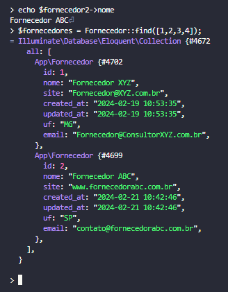

* Recuperand registros com where();
```ClasseModel::where('nome_coluna', 'operador_comparacao', 'valor_comparacao');```
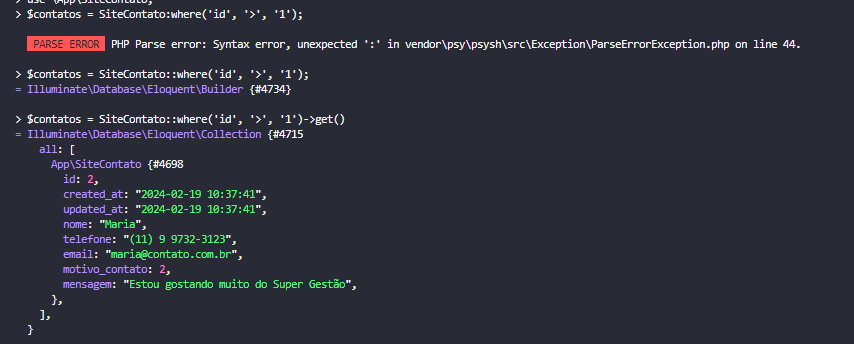
No caso de pesquisas em igual não é necessário utilizar o = :
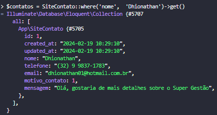

Utilizando operador like na busca com where:
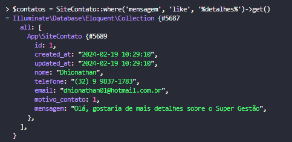

* Busca com whereIn();
```
 $contatos = SiteContato::whereIn('campo_a_ser_comparado_por_igual', 'conjunto_de_parametros');
```
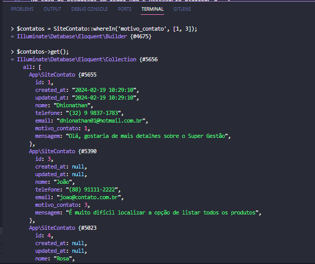

* Busca com whereNotIn();
```$contatos = SiteContato::whereNotIn('campo_a_ser_comparado_por_diferente', 'conjunto_de_parametros');```

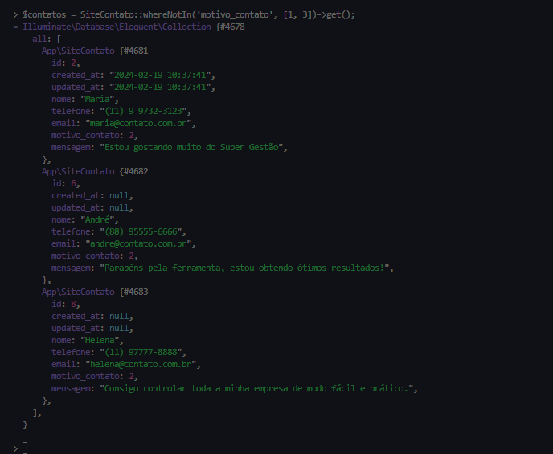
#### Simulando erro devido ao nome da tabela:
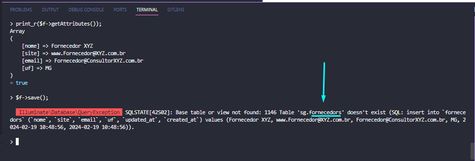 
* Ajustando o erro sobrepondo o valor de table direto na instancia da orm:
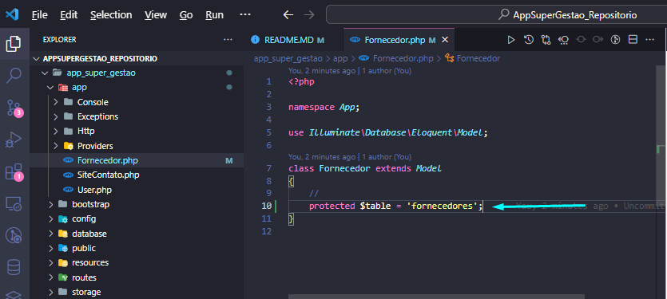
* Sucesso na inserção dos valores:
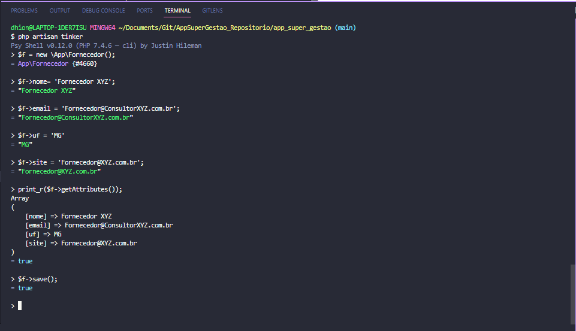
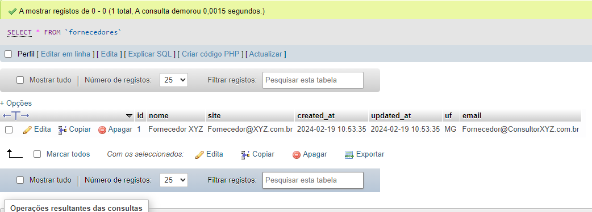

