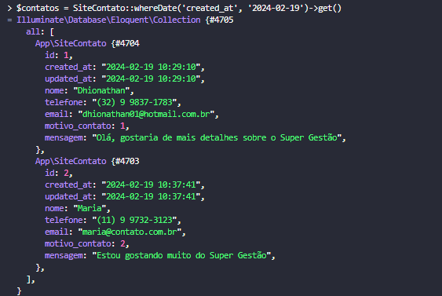

### Comandos usados no tinker
* Instanciando uma classe no tinker:

* As clases instanciadas pelo eloquent orm, vem do banco de dados herdando como atributo todas as suas colunas:

* Logo podemos definir valores para seus respectivos atributos.
- Definindo um valor para o atributo nome em tempo de execuçãoo com tinker:

* Definindo alguns atributos e utilizando o metodo gettAtributes herdado de model no eloquent:

* Salvando os valores no banco de dados pelo tinker COMANDO:
``` $contato->save();```


#### Simulando erro devido ao nome da tabela:
 
* Ajustando o erro sobrepondo o valor de table direto na instancia da orm:

* Sucesso na inserção dos valores:


* Criando registros com metodo estático create, utilizando o atributo fillable:

* Recuperando registros com all();


* Recuperando registros com find();


* Recuperand registros com where();
```
ClasseModel::where('nome_coluna', 'operador_comparacao', 'valor_comparacao');
```

No caso de pesquisas em igual não é necessário utilizar o = :


Utilizando operador like na busca com where:


* Busca com whereIn();
```
 $contatos = SiteContato::whereIn('campo_a_ser_comparado_por_igual', 'conjunto_de_parametros');
```


* Busca com whereNotIn();
```$contatos = SiteContato::whereNotIn('campo_a_ser_comparado_por_diferente', 'conjunto_de_parametros');```


* Buscando com whereBetween();
``` 
$contatos = SiteContato::whereBetween('campo_a_ser_comparado', parametros_de_intervalo);
```

* Buscando com whereNotBetween();

* Busca com where encadeados:
```
$contatos = SiteContato::where('nome', '<>', 'fernando')->whereIn('motivo_contato', [1, 2])->whereBetween('created_at', ['2024-01-01 00:00:00', '2024-02-29 23:59:59'])->get();

```
* Buscando registros com orWhere encadeados.
- OBS: Para concatenar OR conditions na query basta colocar um or antes dos métódos já conhecidos, como orWhereBetween, orWhereIN ...
```
 $contatos = SiteContato::where('nome', '<>', 'Fernando')->orWhereIn('motivo_contato', [1,2])->orWhereBetween('created_at', ['2024-01-01 00:00:00', '2024
-02-29 23:59:59'])->get();
```


* Recuperando valores com whereNull:
```
 $contatos = SiteContato::whereNull('updated_at')->get();
```


* Recuperando valores com whereNotNull:
```
 $contatos = SiteContato::whereNotNull('updated_at')->get();
```


* Recuperar por meio das funções where voltadas para datas:
- whereDate:
```
 $contatos = SiteContato::whereDate('created_at', '2024-02-19')->get()
```

- whereYear:
```
$contatos = SiteContato::whereYear('created_at', '2024')->get();
```

- whereMonth:
```
$contatos = SiteContato::whereMonth('created_at', '2')->get();
``` 

- whereDay:
```
$contatos = SiteContato::whereDay('created_at', '19')->get();
```
- whereTime :
OBS: O operador pode mudar de igual, para maior , menor ou diferente.
```
$contatos = SiteContato::whereTime('created_at', '=', '10:37:41')
```


Recuperando registros com whereColumn:
```
 $contatos = SiteContato::whereColumn('created_at', '>=', 'updated_at')->get()
```


* Recuperando registros aplicando precedência em operacoes lógica ou seja  subGrupos , no caso colocando parentenses na query...
```
$contatos = SiteContato::where(function ($query){$query->where('nome', 'like', '%dhionathan%')->orWhere('nome', 'like', '%helena%');})->where(function ($query){$quer
y->whereIn('motivo_contato', [1,2]);})->orWhereBetween('id', [4,6])->get();
```


* Recuperando registros e ordenando com orderBy:
```
$contatos = SiteContato::orderBy('nome', 'desc')->get();
```


* Combinando orderBy com condições where:
```
$contatos = SiteContato::whereBetween('id', [2,6])->orderBy('nome', 'desc')->get();

```


#### Estudando collections
* Instrução para recuperar o primeiro objeto de uma collection, uma collection é um array de objetos
```$contatos->first();```

* Instrução para recuperar o último objeto da collection:
```$contatos->last();```

* Reverter a ordem dos objetos:
 ```$contatos->reverse();```


