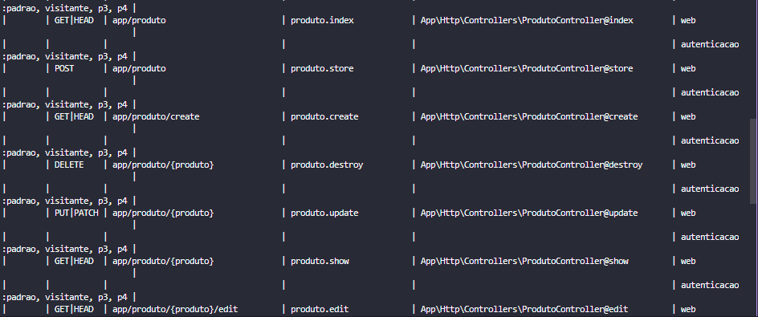
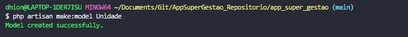
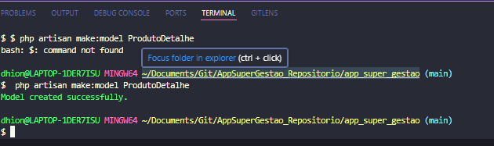
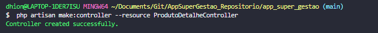
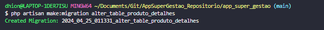
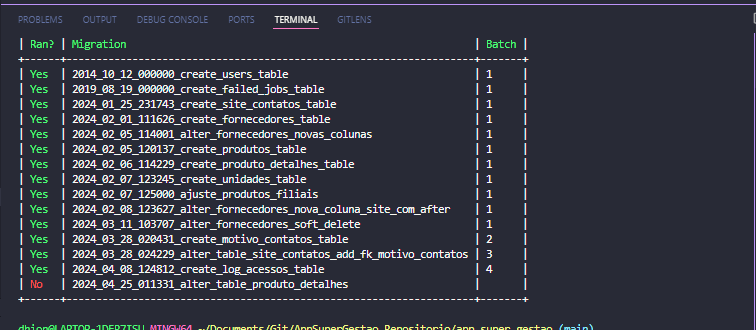
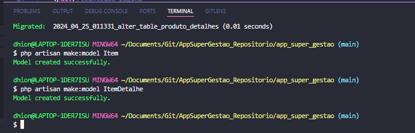
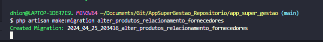

### Finalização do projeto Supergestão.
*  Fazendo a listagem de fornecedores:


* Método Paginate métodos count(), total(), firstItem() e lastItem()


* Recriando o ProdutoController com resources

```
php artisan make:controller --resource ProdutoController --model=Produto
```


* Lista de rotas com a criação do resources:

```php artisan route:list ```



* Criando modelo unidade:

``` php artisan make:model Unidade ``` 


* Inserindo Produtos e Unidade pelo Tinker:
```
> use App\Unidade;
> Unidade::create(['unidade'=> 'UN', 'descricao' => 'Unidade']);
```
```
> use App\Produto;
> Produto::create(['nome'=> 'Geladeira', 'descricao'=> 'Geladeira/Refrigerador Frost Free 375 litros', 'peso'=> '60', 'unidade_id'=> '1']);
```


* Criando model Produto Detalhe.

```$ php artisan make:model ProdutoDetalhe```



* Criando controller ProdutoDetalhe.

```php artisan make:controller --resource ProdutoDetalheControlle```


* Ajuste na tabela produtoDetalhe - Criei errado durante o curso, reparando pelo migrate

```$ php artisan make:migration alter_table_produto_detalhes```




#### Fazendo relacionamento com hasOne e belongsTo para nomes não padronizados:

* Criando os models Item e ItemDetalhe, para substituir pelo produto e produtoDetalhe

```$ php artisan make:model Item ```
```$ php artisan make:model ItemDetalhe ```


* Criando migration para fazer relacionaemnto de produtos a fornecedores:

```php artisan make:migration alter_produtos_relacionamento_fornecedores```



