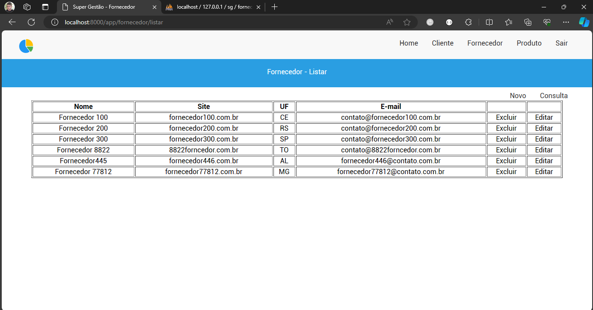
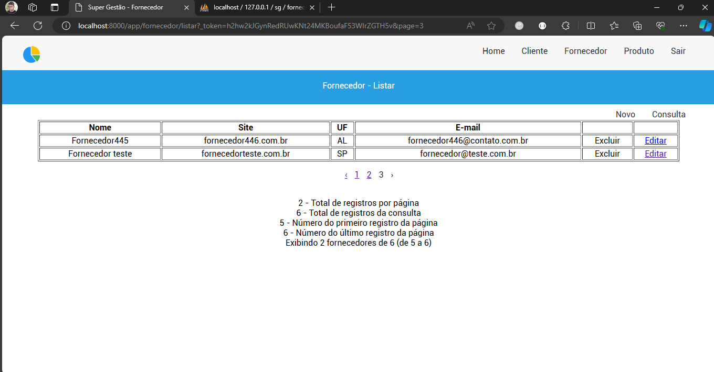
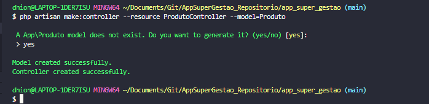

### Finalização do projeto Supergestão.
*  Fazendo a listagem de fornecedores:



* Método Paginate métodos count(), total(), firstItem() e lastItem()



* Recriando o ProdutoController com resources

```
php artisan make:controller --resource ProdutoController --model=Produto
```
