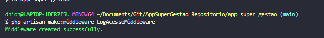
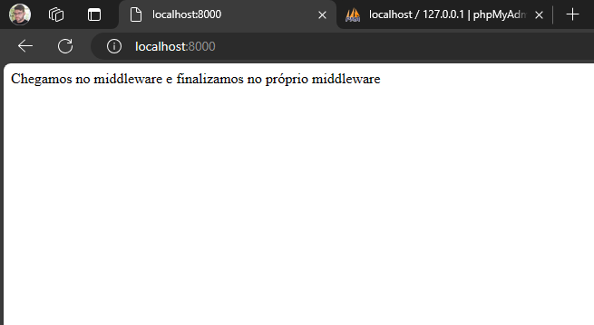
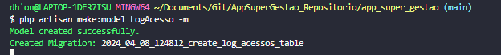
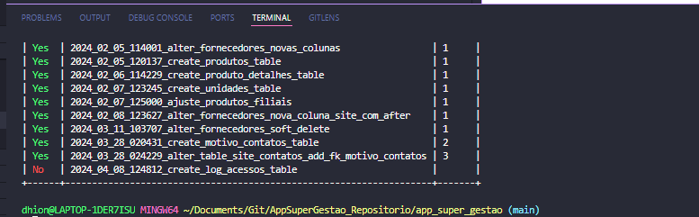
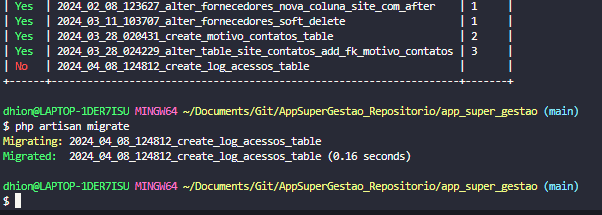
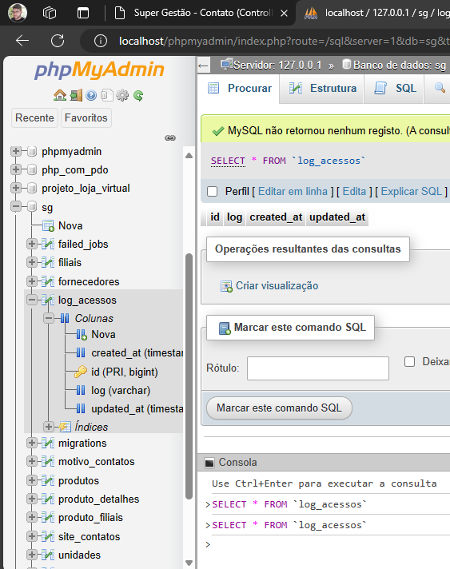
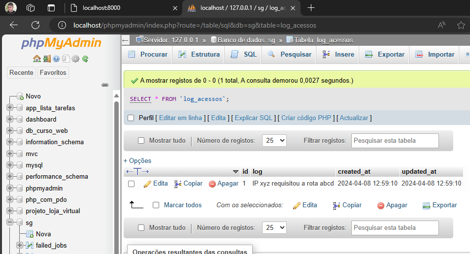
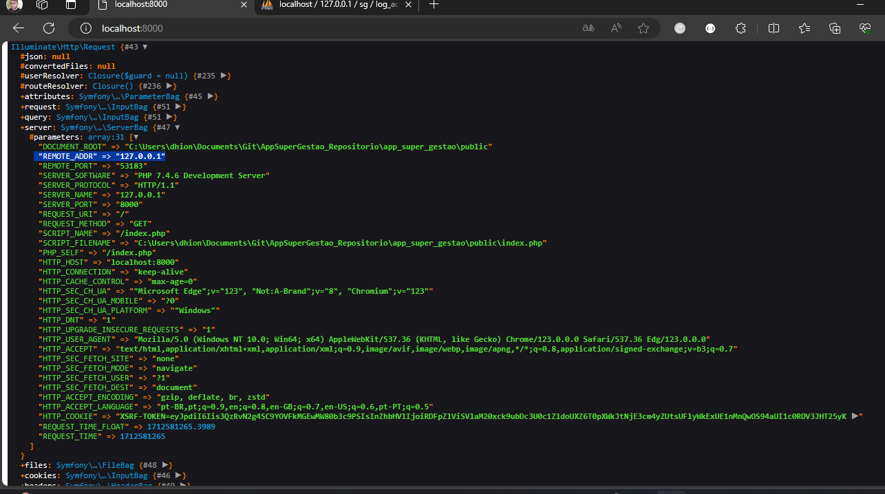
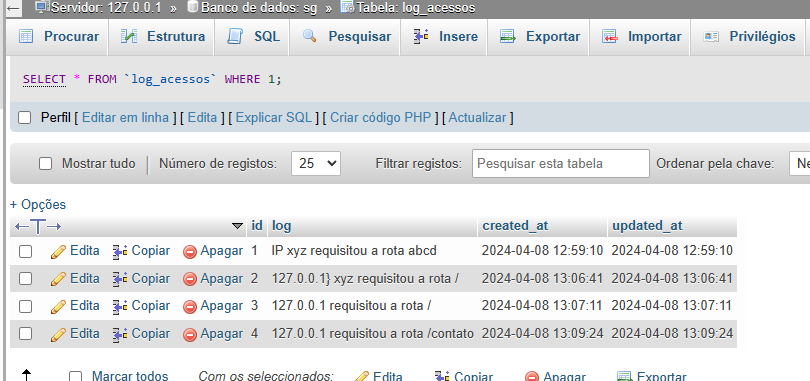

### Anotações sobre estudo de middlewares.
* Criando primeiro middleware
``` 
 php artisan make:middleware LogAcessoMiddleware
```

* Criando um middleware na pagina principal interceptadno a requisição e a travando dentro do prório middleware

* Criandoa  migration e a model LogAcesso
```
php artisan make:model LogAcesso -m 

```


* Exceutando migrate:
```
php artisan migrate
```


* Registrando passagem pelo middleware no banco:

#### OBS: utilizar o dd ao depurar request no middleware pois ele retornar uma objeto response, se usar print_r não ira funcionar.
* Visão geral do dd da $request:

* Salvando Log de Acesso:
