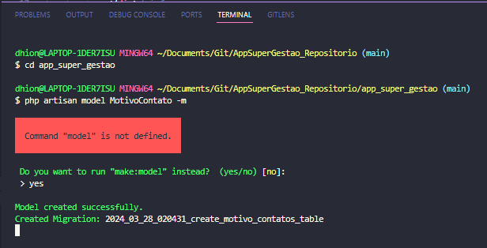
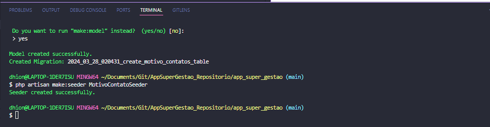
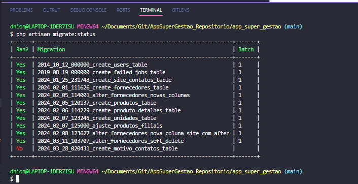
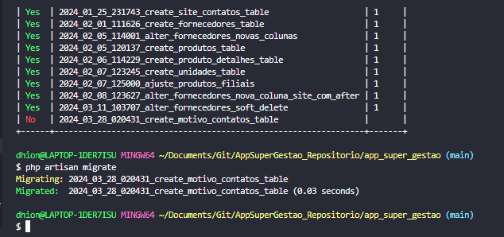
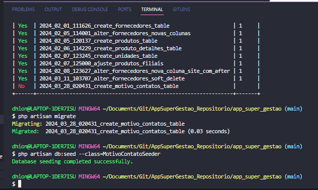

### Fazendo a criação de model pelo eloquent orm 

* Instanciando motivo contato em ambos os canais de comunicação na view e componente
* Criando a seeder :

* Verificando os status  das migrações:
* 
* Executando a migrate:
  
* Executando o seeder:
